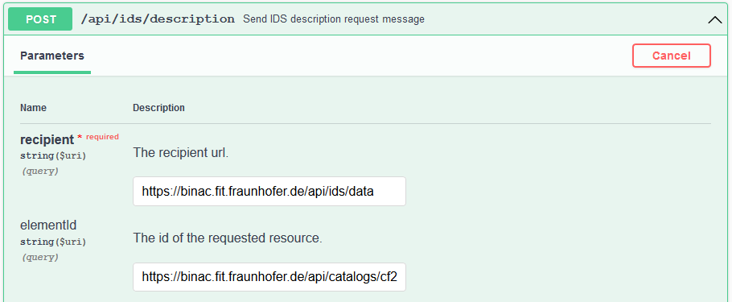
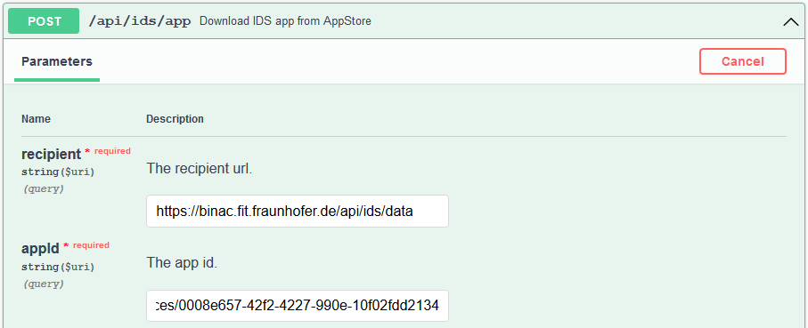

# IDS AppStore
{: .fs-9 }

This section provides a detailed guide on communication with the IDS AppStore.
{: .fs-6 .fw-300 }

---

The IDS AppStore is available at
[https://binac.fit.fraunhofer.de/](https://binac.fit.fraunhofer.de/). It expects IDS
multipart messages at [https://binac.fit.fraunhofer.de/api/ids/data](https://binac.fit.fraunhofer.de/api/ids/data).
The GUI can be accessed at [https://binac.fit.fraunhofer.de/appstore/](https://binac.fit.fraunhofer.de/appstore/).
The access to all addresses is unrestricted.

The [repository](https://github.com/International-Data-Spaces-Association/IDS-AppStore)
is open source and can be accessed at GitHub. Further documentation about the IDS AppStore and IDS
apps in general can be seen [here](https://github.com/International-Data-Spaces-Association/IDS-G).

The Dataspace Connector provides some endpoints to send IDS messages that can be processed by the
AppStore. A full flow of how to query the AppStore, download, and maintain an IDS App can be found
in the following.

## Step 1: Configuration

For managing and deploying images/containers via the provided API, Portainer has to run and be
accessible in your setup. For setting custom configurations, have a look at the
`application.properties`.

```properties
portainer.application.host=localhost
portainer.application.port=9000
portainer.application.username=admin
portainer.application.password=password
```

---

**Note**: A guide for a basic setup of Portainer in Docker can be found
[here](https://documentation.portainer.io/v2.0/deploy/ceinstalldocker/).

---

## Step 2: Create app store entity

First, create an app store via `POST /api/appstores`:

```
curl -X 'POST' \
  'https://localhost:8080/api/appstores' \
  -H 'accept: */*' \
  -H 'Content-Type: application/json' \
  -d '{
  "title": "Example AppStore",
  "description": "Some description",
  "location": "https://binac.fit.fraunhofer.de/api/ids/data"
}'
```


Response:
```json
{
  "creationDate": "2021-08-30T17:29:10.905+0200",
  "modificationDate": "2021-08-30T17:29:10.905+0200",
  "location": "https://binac.fit.fraunhofer.de/api/ids/data",
  "title": "Example AppStore",
  "description": "Some description",
  "_links": {
    "self": {
      "href": "https://localhost:8080/api/appstores/35234f27-ed1e-4093-827e-c12863bd3844"
    },
    "apps": {
      "href": "https://localhost:8080/api/appstores/35234f27-ed1e-4093-827e-c12863bd3844/apps{?page,size}",
      "templated": true
    }
  }
}
```

With a GET on `/api/appstores/apps`, apps downloaded from this app store are listed.

## Step 3: Query IDS AppStore

To query the apps provided by the AppStore, you can use the `POST api/ids/description` endpoint.
With this, you can have a look at the offers like you do with other connectors.



Find an example app in the following.

```json
{
  "@context" : {
    "ids" : "https://w3id.org/idsa/core/",
    "idsc" : "https://w3id.org/idsa/code/"
  },
  "@type" : "ids:ResourceCatalog",
  "@id" : "https://binac.fit.fraunhofer.de/api/catalogs/cf2fa281-8431-4ba9-ac9b-22fa88babc69",
  "ids:offeredResource" : [ {
    "@type" : "ids:AppResource",
    "@id" : "https://binac.fit.fraunhofer.de/api/resources/0008e657-42f2-4227-990e-10f02fdd2134",
    "ids:language" : [ {
      "@id" : "https://w3id.org/idsa/code/EN"
    } ],
    "ids:version" : "1",
    "ids:created" : {
      "@value" : "2021-08-27T08:37:01.126Z",
      "@type" : "http://www.w3.org/2001/XMLSchema#dateTimeStamp"
    },
    "ids:title" : [ {
      "@value" : "HelloWorldDataProcessingApp",
      "@language" : "EN"
    } ],
    "ids:representation" : [ {
      "@type" : "ids:AppRepresentation",
      "@id" : "https://binac.fit.fraunhofer.de/api/representations/8d2c450b-09c7-442e-8819-a114c0335d8f",
      "ids:language" : {
        "@id" : "https://w3id.org/idsa/code/EN"
      },
      "ids:instance" : [ {
        "@type" : "ids:Artifact",
        "@id" : "https://binac.fit.fraunhofer.de/api/artifacts/d83111c9-1e7a-450e-90b7-0c3399767299",
        "ids:fileName" : "",
        "ids:creationDate" : {
          "@value" : "2021-08-27T08:37:02.109Z",
          "@type" : "http://www.w3.org/2001/XMLSchema#dateTimeStamp"
        },
        "ids:byteSize" : 974,
        "ids:checkSum" : "2905321759"
      } ],
      "ids:mediaType" : {
        "@type" : "ids:IANAMediaType",
        "@id" : "https://w3id.org/idsa/autogen/iANAMediaType/12a066fe-408d-4b6a-a7a7-0f0e0bbace3a",
        "ids:filenameExtension" : ""
      },
      "ids:created" : {
        "@value" : "2021-08-27T08:37:01.610Z",
        "@type" : "http://www.w3.org/2001/XMLSchema#dateTimeStamp"
      },
      "ids:title" : [ ],
      "ids:description" : [ ],
      "ids:modified" : {
        "@value" : "2021-08-27T08:37:01.610Z",
        "@type" : "http://www.w3.org/2001/XMLSchema#dateTimeStamp"
      },
      "ids:representationStandard" : {
        "@id" : ""
      },
      "ids:dataAppDistributionService" : {
        "@id" : "https://binac.fit.fraunhofer.de"
      },
      "ids:dataAppRuntimeEnvironment" : "docker",
      "ids:dataAppInformation" : {
        "@type" : "ids:SmartDataApp",
        "@id" : "https://binac.fit.fraunhofer.de/api/apps/ee055591-c2cf-4476-b524-a67c69a2ff30",
        "ids:supportedUsagePolicies" : [ {
          "@id" : "https://w3id.org/idsa/code/ALLOW_DATA_USAGE"
        } ],
        "ids:appDocumentation" : "App-related human-readable documentation.",
        "ids:appEnvironmentVariables" : "Env1=environmentvariable;Env2=environmentvariable2",
        "ids:appStorageConfiguration" : "/data/temp:/temp",
        "ids:appEndpoint" : [ {
          "@type" : "ids:AppEndpoint",
          "@id" : "https://binac.fit.fraunhofer.de/api/endpoints/9d64b452-78a6-4b3a-9fb9-00ae84bbee73",
          "ids:path" : "/output",
          "ids:endpointInformation" : [ {
            "@value" : "More information about the endpoint",
            "@language" : "EN"
          } ],
          "ids:endpointDocumentation" : [ {
            "@id" : "https://app.swaggerhub.com/apis/app/1337"
          } ],
          "ids:appEndpointType" : {
            "@id" : "https://w3id.org/idsa/code/OUTPUT_ENDPOINT"
          },
          "ids:appEndpointMediaType" : {
            "@type" : "ids:IANAMediaType",
            "@id" : "https://w3id.org/idsa/autogen/iANAMediaType/6bcd4034-4d34-4142-b93b-ef13c4ce4404",
            "ids:filenameExtension" : "application/json"
          },
          "ids:appEndpointProtocol" : "HTTP/1.1",
          "ids:accessURL" : {
            "@id" : "/output"
          },
          "ids:appEndpointPort" : 80
        } ]
      }
    } ],
    "ids:theme" : [ ],
    "ids:contentPart" : [ ],
    "ids:defaultRepresentation" : [ ],
    "ids:keyword" : [ {
      "@value" : "data",
      "@language" : "EN"
    }, {
      "@value" : "processing",
      "@language" : "EN"
    }, {
      "@value" : "fit",
      "@language" : "EN"
    } ],
    "ids:temporalCoverage" : [ ],
    "ids:paymentModality" : [ {
      "@id" : "https://w3id.org/idsa/code/FREE"
    } ],
    "ids:publisher" : {
      "@id" : "https://fit.fraunhofer.de"
    },
    "ids:sovereign" : {
      "@id" : "https://fit.fraunhofer.de"
    },
    "ids:description" : [ {
      "@value" : "data app for processing data.",
      "@language" : "EN"
    } ],
    "ids:spatialCoverage" : [ ],
    "ids:modified" : {
      "@value" : "2021-08-27T08:37:01.126Z",
      "@type" : "http://www.w3.org/2001/XMLSchema#dateTimeStamp"
    },
    "ids:resourceEndpoint" : [ {
      "@type" : "ids:ConnectorEndpoint",
      "@id" : "https://w3id.org/idsa/autogen/connectorEndpoint/4114205c-3a41-4230-a498-cee2b67bcf3a",
      "ids:endpointInformation" : [ ],
      "ids:endpointDocumentation" : [ {
        "@id" : ""
      } ],
      "ids:accessURL" : {
        "@id" : "https://binac.fit.fraunhofer.de/api/resources/0008e657-42f2-4227-990e-10f02fdd2134"
      }
    } ],
    "ids:resourcePart" : [ ],
    "ids:standardLicense" : {
      "@id" : "https://www.apache.org/licenses/LICENSE-2.0"
    },
    "ids:sample" : [ ],
    "ids:contractOffer" : [ {
      "@type" : "ids:ContractOffer",
      "@id" : "https://binac.fit.fraunhofer.de/api/contracts/9b73cd72-42a8-46a2-8493-b3c89eb5ccc2",
      "ids:permission" : [ {
        "@type" : "ids:Permission",
        "@id" : "https://binac.fit.fraunhofer.de/api/rules/ab226e39-b635-4965-8b1c-06e33a89f619",
        "ids:title" : [ {
          "@value" : "Example Usage Policy",
          "@type" : "http://www.w3.org/2001/XMLSchema#string"
        } ],
        "ids:assignee" : [ ],
        "ids:assigner" : [ ],
        "ids:postDuty" : [ ],
        "ids:description" : [ {
          "@value" : "n-times-usage",
          "@type" : "http://www.w3.org/2001/XMLSchema#string"
        } ],
        "ids:constraint" : [ {
          "@type" : "ids:Constraint",
          "@id" : "https://w3id.org/idsa/autogen/constraint/e0a353a2-ef1d-4932-b3cf-a5a0a5a1455e",
          "ids:leftOperand" : {
            "@id" : "https://w3id.org/idsa/code/COUNT"
          },
          "ids:rightOperand" : {
            "@value" : "5",
            "@type" : "http://www.w3.org/2001/XMLSchema#double"
          },
          "ids:operator" : {
            "@id" : "https://w3id.org/idsa/code/LTEQ"
          }
        } ],
        "ids:action" : [ {
          "@id" : "https://w3id.org/idsa/code/USE"
        } ],
        "ids:preDuty" : [ ]
      } ],
      "ids:provider" : {
        "@id" : ""
      },
      "ids:contractEnd" : {
        "@value" : "2021-12-06T11:33:44.995Z",
        "@type" : "http://www.w3.org/2001/XMLSchema#dateTimeStamp"
      },
      "ids:consumer" : {
        "@id" : ""
      },
      "ids:prohibition" : [ ],
      "ids:obligation" : [ ],
      "ids:contractStart" : {
        "@value" : "2021-08-27T08:37:02.267Z",
        "@type" : "http://www.w3.org/2001/XMLSchema#dateTimeStamp"
      },
      "ids:contractDate" : {
        "@value" : "2021-09-01T07:13:04.703Z",
        "@type" : "http://www.w3.org/2001/XMLSchema#dateTimeStamp"
      }
    } ]
  } ],
  "ids:requestedResource" : [ ]
}
```

## Step 4: Download IDS App

To download an app, you need the id of the `ids:AppResource`. With this and the id from the app
store entity you previously registered via the REST API, you can then download the app's metadata
as shown in the following image.



As a response, you receive the created app entity:

```json
{
  "creationDate": "2021-09-01T09:13:43.957+0200",
  "modificationDate": "2021-09-01T09:13:43.957+0200",
  "remoteId": "https://binac.fit.fraunhofer.de/api/resources/0008e657-42f2-4227-990e-10f02fdd2134",
  "remoteAddress": "https://binac.fit.fraunhofer.de/api/resources/0008e657-42f2-4227-990e-10f02fdd2134",
  "docs": "App-related human-readable documentation.",
  "envVariables": "Env1=environmentvariable;Env2=environmentvariable2",
  "storageConfig": "/data/temp:/temp",
  "supportedPolicies": [
    "PROVIDE_ACCESS"
  ],
  "keywords": [
    "processing",
    "data",
    "fit"
  ],
  "publisher": "https://fit.fraunhofer.de",
  "sovereign": "https://fit.fraunhofer.de",
  "language": "https://w3id.org/idsa/code/EN",
  "license": "https://www.apache.org/licenses/LICENSE-2.0",
  "endpointDocumentation": "https://app.com",
  "distributionService": "https://binac.fit.fraunhofer.de",
  "runtimeEnvironment": "docker",
  "additional": {
    "ids:byteSize": "974",
    "ids:checkSum": "2905321759",
    "ids:mediaType": "",
    "ids:fileName": "",
    "ids:language": "https://w3id.org/idsa/code/EN"
  },
  "_links": {
    "self": {
      "href": "https://localhost:8080/api/apps/c18fbc6c-e09f-4ded-91a8-abbc9e147ba6"
    },
    "endpoints": {
      "href": "https://localhost:8080/api/apps/c18fbc6c-e09f-4ded-91a8-abbc9e147ba6/endpoints{?page,size}",
      "templated": true
    }
  }
}
```

It is automatically connected to appropriate endpoints provided by this app - for data flow
and for configuration purposes.

To get to know what apps were downloaded from what AppStore, you can use the following endpoint:
`GET /api/appstores/{id}/apps`.

## Step 5: Deploy and maintain IDS Apps

The endpoint `PUT /api/apps/{id}/actions` can be used to perform certain actions for downloaded
apps - by using Portainer's REST API. Currently, the Dataspace Connector provides four actions:
* `start`: A container is started. If there is no provided container for an app yet, or the image
  has not been downloaded from the IDS AppStore's registry, this will be done first.
* `stop`: A running container is stopped.
* `delete`: A stopped container is deleted.
* `describe`: Can be used to get current status information of a running container.
